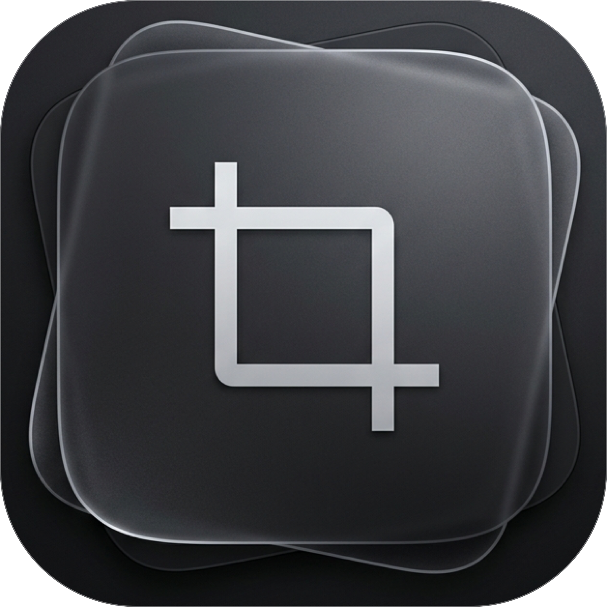
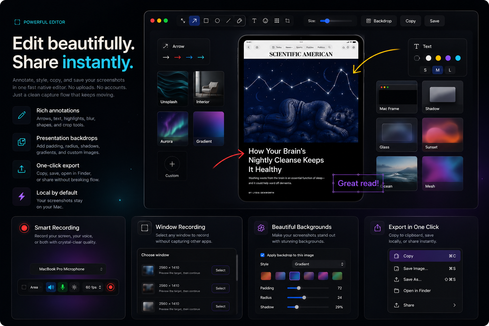
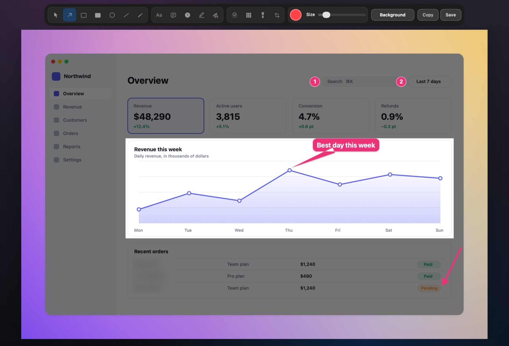
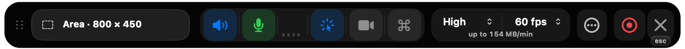

<div align="center">



# Shotnix

**Captures d’écran, enregistrement de l’écran et montage vidéo pour votre Mac.**<br/>
Gratuit et open source. Une app native d’environ 11 Mo, et vos captures ne quittent jamais votre Mac.

[](https://github.com/OMARVII/Shotnix/releases/latest)
[](https://github.com/OMARVII/Shotnix/stargazers)
[](#installation)
[](LICENSE)

[Site web](https://shotnix.com/fr) · [Télécharger](https://github.com/OMARVII/Shotnix/releases/latest) · [Nouveautés (en anglais)](CHANGELOG.md) · [Feuille de route (en anglais)](ROADMAP.md)

[English](README.md) · [Deutsch](README.de.md) · **Français** · [简体中文](README.zh-CN.md)

<a href="https://shotnix.com/media/shotnix-editor-playback.mp4"></a>

<sub>L’éditeur vidéo de Shotnix, avec une démo tirée d’un simple enregistrement de l’écran : des zooms sur les clics, un pointeur fluide, des sous-titres issus de la narration et le raccourci affiché à l’écran.</sub>

<a href="https://shotnix.com/media/shotnix-editor-playback.mp4"><b>▶ Regarder en pleine qualité (Retina, 60 fps)</b></a><br/>
<sub>L’animation ci-dessus est compressée pour que la page se charge vite. Shotnix exporte jusqu’en 4K à 60 fps.</sub>

</div>



## Pourquoi Shotnix

<table>
<tr>
<td width="50%"><b>Une seule app pour tout</b><br/>Captures d’écran, reconnaissance de texte, captures épinglées, historique, enregistrement de l’écran et un véritable éditeur vidéo.</td>
<td width="50%"><b>Natif et léger</b><br/>Écrit en Swift pour macOS. Un petit téléchargement qui s’ouvre en un instant et sait se faire oublier.</td>
</tr>
<tr>
<td width="50%"><b>Privé par principe</b><br/>Ni compte, ni cloud, ni télémétrie. Les sous-titres et la reconnaissance de texte sont traités sur votre Mac.</td>
<td width="50%"><b>Vraiment gratuit</b><br/>Sous licence MIT. Sans filigrane, sans abonnement. Signé, notarisé, et il se met à jour tout seul.</td>
</tr>
</table>

## Captures d’écran



- **Capturez tout :** une zone, une fenêtre, le plein écran, tous les écrans d’un coup, ou une longue page que vous faites défiler, assemblée en une seule image.
- **Cadrez juste :** maintenez ⇧ en relâchant pour affiner la sélection avant la capture.
- **Annotez :** flèches, formes, texte, bulles, étapes numérotées, projecteur, surligneurs, et un flou ou une pixélisation qui ne laissent rien passer.
- **Enchaînez :** copiez le texte de n’importe quoi (tableaux et liens compris), épinglez vos captures à l’écran et retrouvez-les grâce au texte qu’elles contiennent.

## Enregistrement de l’écran et montage vidéo

- **Enregistrez** une zone, une fenêtre ou un écran à 60 fps, avec votre voix, le son de l’ordinateur et votre caméra. Mettez en pause, reprenez, et ne perdez jamais une prise, même après un plantage.
- **Déjà monté à l’ouverture :** des zooms sur vos clics, le vrai pointeur de macOS redessiné avec fluidité, et votre style mémorisé.
- **Peaufinez sur votre Mac :** sous-titres et montage par texte à partir de votre narration (avec traduction sous macOS 15+), musique qui s’efface sous votre voix, cartons de titre, transitions et votre logo.
- **Exportez** en MP4 jusqu’en 4K à 60 fps ou en GIF, en arrière-plan, ou directement dans le presse-papiers.



<details>
<summary><b>Toutes les fonctionnalités</b></summary>

**Capture**

- **Zone** — faites glisser pour sélectionner n’importe quelle région
- **Fenêtre** — cliquez sur une fenêtre pour la capturer seule, avec ombre portée et marge transparente en option
- **Plein écran** — capturez tout l’écran en un instant
- **Tous les écrans** — chaque écran connecté en même temps, une image par écran
- **Zone précédente** — recapturez la dernière région sélectionnée d’un seul raccourci
- **Sélection ajustable** — maintenez Maj en relâchant (ou faites-en le comportement par défaut dans Réglages) pour affiner les bords à la souris ou avec les touches fléchées, puis appuyez sur Retour
- **Capture défilante** — faites défiler une longue page et Shotnix l’assemble en une seule image, tout en hauteur ; appuyez sur Échap ou de nouveau sur le raccourci pour arrêter
- **Capture avec minuteur** — un compte à rebours de 3, 5 ou 10 secondes avant la capture, annulable à tout moment
- **Enregistrement de l’écran** — enregistrez une zone, une fenêtre ou un écran en MP4 à 60 fps, avec le son de l’ordinateur, le micro et votre caméra. Mettez en pause et reprenez, supprimez une prise ou démarrez après un compte à rebours de 3, 5 ou 10 secondes. L’enregistrement d’une fenêtre suit cette fenêtre et inclut ses menus et ses boîtes de dialogue. Les enregistrements survivent aux plantages et sont récupérés au lancement suivant, un micro qui se déconnecte est remplacé sans décaler le son, et les écrans 5K et au-delà sont enregistrés en HEVC. Arrêtez l’enregistrement où que vous soyez avec `Ctrl + Cmd + Esc`
- **Éditeur vidéo** — transformez n’importe quel enregistrement en démo soignée : des zooms qui suivent votre pointeur, le vrai pointeur de macOS redessiné avec fluidité, des arrière-plans, des annotations (texte, flèches, surlignages, flou, projecteur), votre caméra sur son propre calque (avec plusieurs dispositions), des sous-titres en quatre styles et le montage par texte, créés sur votre Mac (avec traduction sur l’appareil sous macOS 15+), une musique de fond qui s’efface sous votre voix, des logos et des images en surimpression, des cartons d’intro et de fin, des transitions, plusieurs enregistrements dans une même vidéo, un son plus net, des vidéos verticales, le rognage, et des exports en MP4 ou en GIF qui tournent en arrière-plan
- **OCR** — extrayez le texte de n’importe quelle partie de l’écran, en gardant colonnes et tableaux dans l’ordre de lecture ; les liens du résultat sont cliquables, et vous choisissez les langues de reconnaissance
- **Lecture de codes QR et de codes-barres** — décodez QR, Code 128, EAN, UPC, Aztec, Data Matrix, PDF417 et bien d’autres depuis une zone de l’écran

**Annoter et modifier**

- Flèches, rectangles (coins droits ou arrondis), ellipses, lignes, dessin à main levée
- Texte et bulles : toutes les tailles de 10 à 96 pt, en gras ou non, sur plusieurs lignes ; double-cliquez pour modifier à nouveau
- Surligneur et surligneur à main levée pour mettre un passage en valeur
- Projecteur pour assombrir tout sauf l’essentiel
- Flou et pixélisation d’intensité réglable, qui couvrent toujours toute la zone, sur n’importe quel écran
- Repères numérotés pour les guides pas à pas
- Arrière-plans de présentation pour des captures soignées, avec des images prédéfinies ou les vôtres
- Rognage que vous pouvez annuler ou reprendre plus tard ; les annotations restent modifiables
- Les images sont enregistrées à la pleine résolution de la capture, quel que soit l’écran où se trouve l’éditeur, et Shotnix demande confirmation avant de fermer ou de quitter s’il reste des modifications non enregistrées

**Sans perdre le fil**

- Vignette d’accès rapide après chaque capture — survolez-la pour afficher les commandes (Copier, Enregistrer, Modifier, Épingler, Fermer)
- Glisser-déposer depuis la vignette directement dans le Finder, Slack ou n’importe quelle app
- Un balayage sur le trackpad pour faire disparaître la vignette
- Badge de confirmation de copie — un retour visuel avant la fermeture
- Raccourcis clavier sur la vignette — `Cmd+C` pour copier, `Cmd+S` pour enregistrer, `Cmd+E` pour modifier, `Esc` pour fermer
- Menu contextuel sur la vignette (clic droit)
- Animations à ressort et micro-interactions pour une finition haut de gamme
- Épinglez des captures qui flottent sur votre bureau (déplaçables, redimensionnables)
- Historique complet des captures, présenté en grille : recherchez par le texte contenu dans les captures (commencez simplement à taper), filtrez par type de capture, sélectionnez au clavier, faites glisser des captures vers d’autres apps sous forme de fichiers et annulez une suppression avec ⌘Z
- Par défaut, l’historique conserve les captures indéfiniment, ou seulement celles des 7, 30 ou 90 derniers jours (ou les 100, 500 ou 1 000 dernières) ; il indique l’espace qu’il occupe et peut faire le ménage à la demande
- Les modifications faites dans l’éditeur de captures apparaissent dans l’historique, et la capture d’origine est conservée à côté
- Raccourcis globaux qui fonctionnent depuis n’importe quelle app

**Personnalisable**

- Fenêtre de réglages à onglets (Général, Raccourcis, Captures, Enregistrement, À propos)
- Raccourcis globaux personnalisables, avec retour aux valeurs par défaut en un clic
- Recherche de mises à jour intégrée, grâce à Sparkle, pour les versions officielles
- Export en PNG ou JPEG, avec un curseur de qualité JPEG (et en WebP, sur les Mac dont le système sait l’écrire)
- Choix du dossier d’enregistrement automatique ; les captures prises dans la même seconde ont chacune leur propre fichier numéroté
- Actions automatiques après la capture (copie dans le presse-papiers, enregistrement sur le disque)
- Position (à gauche ou à droite) et durée d’affichage de la vignette réglables
- Sons de capture (désactivables)
- Masquage des icônes du bureau pendant la capture (sans redémarrer le Finder)
- Lancement à l’ouverture de session
- Journal des modifications « Nouveautés » dans l’onglet À propos

</details>

## Langues

Shotnix parle **English, Deutsch, Français et 简体中文**, de la barre des menus à l’éditeur vidéo. Il suit la langue de votre Mac ; pour en choisir une autre rien que pour Shotnix, ouvrez ses Réglages → Général → Langue. Les traductions se trouvent dans [`Localization/`](Localization/), et les corrections de locuteurs natifs sont les bienvenues.

## Installation

### Téléchargement (recommandé)

1. Téléchargez le dernier `.dmg` sur [**shotnix.com**](https://shotnix.com/fr) ou sur la page [**Releases**](https://github.com/OMARVII/Shotnix/releases/latest)
2. Ouvrez le DMG et faites glisser **Shotnix** dans votre dossier Applications
3. Accordez l’autorisation **Enregistrement de l’écran** quand macOS vous la demande

### Compiler depuis les sources

```bash
git clone https://github.com/OMARVII/Shotnix.git
cd Shotnix
bash build-app.sh
```

Le script compile une version de production, assemble le bundle de l’app, signe le binaire en local et copie `Shotnix.app` dans `/Applications`.

**Prérequis :** macOS 13+, Swift 5.9+

## Raccourcis clavier

| Raccourci | Action |
|---|---|
| `Cmd + Shift + 4` | Capturer une zone |
| `Cmd + Shift + 5` | Capturer une fenêtre |
| `Cmd + Shift + 3` / `Cmd + Shift + 6` | Capturer le plein écran |
| `Cmd + Shift + 7` | Capturer la zone précédente |

La capture défilante, la capture de texte (OCR), la capture de tous les écrans, la capture avec minuteur et les actions d’enregistrement n’ont pas de raccourci par défaut : Shotnix ne s’approprie ainsi jamais les touches des autres apps (`Cmd + Shift + S` correspond à « Enregistrer sous… » presque partout). Attribuez-leur le raccourci de votre choix dans **Réglages → Raccourcis**. Les installations antérieures à la version 0.24 conservent leurs raccourcis `Cmd + Shift + S` et `Cmd + Shift + O`.

**Sur la vignette d’accès rapide :**

| Raccourci | Action |
|---|---|
| `Cmd + C` | Copier la capture dans le presse-papiers |
| `Cmd + S` | Enregistrer dans un fichier |
| `Cmd + E` | Ouvrir dans l’éditeur de captures |
| `Esc` | Fermer la vignette |

**Pendant un enregistrement :**

| Raccourci | Action |
|---|---|
| `Ctrl + Cmd + Esc` | Arrêter l’enregistrement (depuis n’importe quelle app) |
| `Esc` | Arrêter l’enregistrement quand Shotnix est au premier plan |

## Confidentialité

Shotnix n’a ni compte, ni télémétrie, ni cloud. Tout se passe sur votre Mac. macOS vous demande votre accord avant que Shotnix puisse utiliser :

- **Enregistrement de l’écran :** pour prendre des captures d’écran et des enregistrements.
- **Micro et Caméra :** uniquement quand vous les activez pour un enregistrement.
- **Reconnaissance vocale :** pour créer les sous-titres, sur ce Mac.
- **Accessibilité** (en option) : pour afficher dans un enregistrement les raccourcis clavier que vous utilisez.

L’app ne se connecte à Internet que pour rechercher des mises à jour.

## Architecture

Shotnix est un projet Swift Package Manager — pas de `.xcodeproj`, pas de storyboards. L’exécutable n’est qu’une fine enveloppe autour d’une bibliothèque `ShotnixCore` testable.

```
Sources/
├── Shotnix/       Point d’entrée de l’exécutable
└── ShotnixCore/
    ├── App/           Cycle de vie de l’app, barre des menus, réglages
    ├── Capture/       Moteur de capture (ScreenCaptureKit, avec CGWindow en secours)
    ├── Annotation/    Éditeur à 15 outils, avec annuler/rétablir
    ├── History/       Historique persistant des captures (~Library/Application Support/)
    ├── Hotkeys/       Raccourcis globaux personnalisables
    ├── OCR/           Reconnaissance de texte avec le framework Vision
    ├── Overlay/       Vignette d’accès rapide, fenêtres épinglées, toasts
    ├── Video/         Éditeur vidéo : timeline, zooms, pointeur, caméra, sous-titres, son, export
    └── Utilities/     Export d’images, autorisations, masquage des icônes du bureau
Localization/          Catalogue de chaînes, traductions et glossaire (scripts/localize.py)
```

## Dépendances

| Paquet | Rôle |
|---|---|
| [KeyboardShortcuts](https://github.com/sindresorhus/KeyboardShortcuts) | Raccourcis clavier globaux personnalisables |
| [Sparkle](https://sparkle-project.org/) | Recherche de mises à jour intégrée pour les versions signées |

L’app garde volontairement ses dépendances au strict minimum.

## Feuille de route

- [x] Corrections de la capture multi-écran
- [x] Prise en main au premier lancement
- [x] Export WebP
- [x] Actions automatiques après la capture
- [x] Refonte haut de gamme de la vignette (commandes au survol, animations à ressort, balayage pour fermer)
- [x] Barre d’outils d’annotation épurée (boutons contextuels, canevas centré, fond d’éditeur sombre)
- [x] Outil d’annotation à étapes numérotées
- [x] Identité visuelle haut de gamme (icône de l’app, icône de la barre des menus, écran de bienvenue)
- [x] Interface des réglages et moteur de capture modernisés
- [x] Animations de vignette plus vives + retour haptique + boutons au pixel près
- [x] API natives de macOS (à la place des anciens appels shell `Process()`)
- [x] Raccourcis personnalisables
- [x] Capture de fenêtre avec ombre et marge
- [x] Capture avec délai ou minuteur (3 s, 5 s, 10 s)
- [x] Mise à jour automatique
- [x] Signature développeur + processus de notarisation
- [x] Vignettes empilées après la capture
- [x] Éditeur vidéo : zooms, pointeur fluide, arrière-plans, caméra, sous-titres, montage par texte, export MP4/GIF
- [x] Sélection ajustable, un vrai moteur d’assemblage pour la capture défilante et un OCR qui respecte la mise en page
- [x] Nouveaux outils d’annotation : projecteur, bulle, surligneur à main levée, rectangles arrondis
- [x] Historique : durée de conservation, nettoyage et filtres par type
- [x] Pause et reprise, suppression d’une prise et enregistrements à l’abri des plantages
- [x] Éditeur vidéo : musique, images en surimpression, cartons de titre, transitions, projets à plusieurs enregistrements, styles et traduction des sous-titres
- [x] Localisation : allemand, français et chinois simplifié

## Contribuer

Les contributions sont les bienvenues. Ouvrez d’abord une issue pour discuter de ce que vous aimeriez changer. Les corrections de traduction sont particulièrement appréciées : consultez [`Localization/GLOSSARY.md`](Localization/GLOSSARY.md).

Si Shotnix vous fait gagner du temps, une ⭐ sur GitHub aide d’autres personnes à le découvrir.

## Licence

[MIT](LICENSE). La provenance des ressources tierces est indiquée dans [THIRD_PARTY_NOTICES.md](THIRD_PARTY_NOTICES.md).
