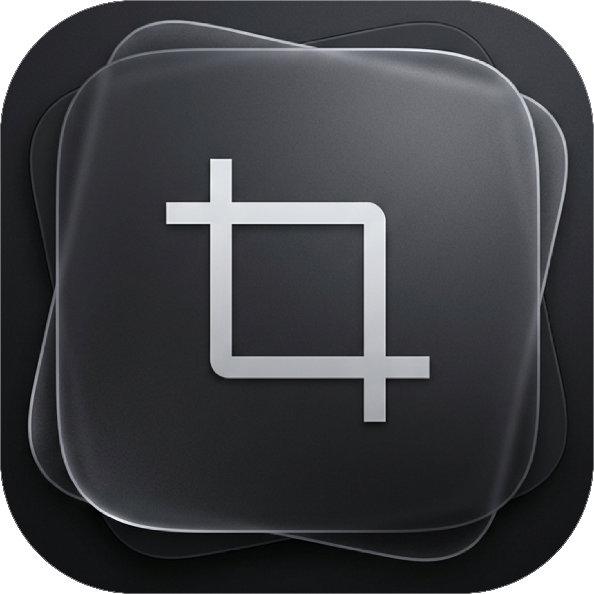
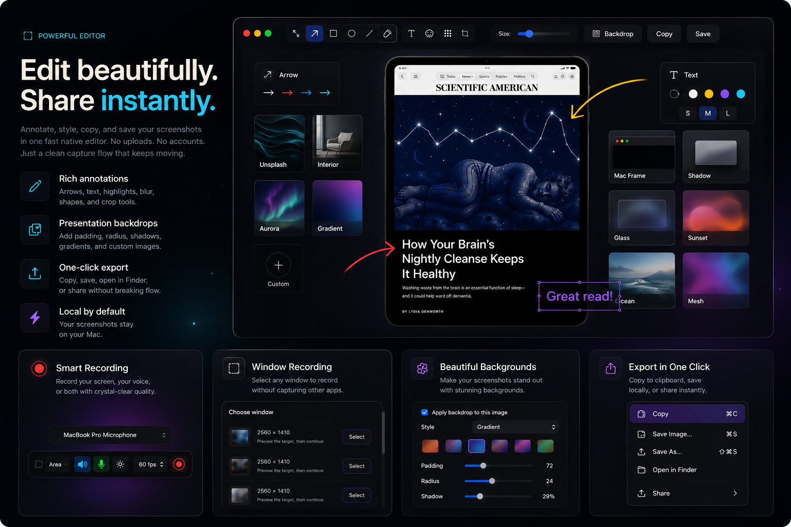

<p align="center">
  
  <h1 align="center">Shotnix</h1>
  <p align="center">
    A fast, focused screenshot and screen recording utility for macOS.<br/>
    Capture, record, annotate, pin, and extract text — all from your menu bar.
  </p>
  <p align="center">
    <a href="https://shotnix.com/"></a>
    <a href="https://github.com/OMARVII/Shotnix/releases/latest"></a>
    
    <a href="LICENSE"></a>
    
  </p>
</p>

---

> [!NOTE]
> **Shotnix is in beta (v0.18.0-beta).** Official downloads are signed and notarized with Apple Developer ID. The source code is available here for review and local builds.

<p align="center">
  
</p>

## Why Shotnix?

macOS has built-in screenshot tools, but they stop at capture. Shotnix picks up where they leave off — annotate with arrows, blur sensitive info, pin screenshots to your desktop, extract text with OCR, and access everything from a lightweight menu bar app. No subscription. No account. Just a fast tool that stays out of your way.

Visit **[shotnix.com](https://shotnix.com/)** for the latest download and project overview.

## Features

**Capture anything**
- **Area** — drag to select any region
- **Window** — click any window to capture it
- **Fullscreen** — grab the entire screen instantly
- **Previous area** — re-capture the last selected region with one shortcut
- **Scrolling** — capture content beyond the visible area
- **Screen recording** — record an area, window, or display with system audio, microphone audio, cursor control, quality, and FPS options
- **OCR** — extract and copy text from any part of the screen
- **QR scanning** — scan QR codes from a selected screen area

**Annotate and edit**
- Arrows, rectangles, ellipses, lines, freehand drawing
- Text annotations with customizable font and color
- Highlighter for emphasizing content
- Presentation backdrops for polished screenshot exports, including image presets and custom images
- Blur and pixelate for redacting sensitive info
- Numbered markers for step-by-step guides
- Crop to resize after capture

**Stay in flow**
- Quick access overlay after every capture — hover to reveal controls (copy, save, edit, pin, close)
- Drag-and-drop from overlay directly into Finder, Slack, or any app
- Swipe-to-dismiss overlay with trackpad gesture
- Copy confirmation badge — visual feedback before closing
- Keyboard shortcuts on overlay — `Cmd+C` copy, `Cmd+S` save, `Cmd+E` edit, `Esc` dismiss
- Right-click context menu on overlay
- Spring animations and micro-interactions for a premium feel
- Pin screenshots to float on your desktop (draggable, resizable)
- Full capture history with grid browser
- Global hotkeys that work from anywhere

**Configurable**
- Tabbed settings window (General, Shortcuts, Screenshots, Recording, About)
- Customizable global hotkeys with one-click default reset
- Sparkle-powered in-app update checks for official builds
- Export as PNG, JPEG, or WebP, with a JPEG quality slider
- Auto-save location picker
- After-capture auto-actions (auto-copy, auto-save)
- Configurable overlay position (left or right) and timeout
- Capture sound effects (toggleable)
- Hide desktop icons during capture
- Launch at login
- What's New changelog in the About tab

## Install

### Download (recommended)

1. Grab the latest `.dmg` from [**shotnix.com**](https://shotnix.com/) or [**Releases**](https://github.com/OMARVII/Shotnix/releases/latest)
2. Open the DMG and drag **Shotnix** to your Applications folder
3. Grant **Screen Recording** permission when prompted

### Build from source

```bash
git clone https://github.com/OMARVII/Shotnix.git
cd Shotnix
bash build-app.sh
```

This compiles a release build, assembles the app bundle, signs the binary locally, and copies `Shotnix.app` to `/Applications`.

**Requirements:** macOS 13+, Swift 5.9+

## Hotkeys

| Shortcut | Action |
|---|---|
| `Cmd + Shift + 4` | Area capture |
| `Cmd + Shift + 5` | Window capture |
| `Cmd + Shift + 3` / `Cmd + Shift + 6` | Fullscreen capture |
| `Cmd + Shift + 7` | Previous area capture |
| `Cmd + Shift + O` | OCR text extraction |
| `Cmd + Shift + S` | Scrolling capture |

**On the quick access overlay:**

| Shortcut | Action |
|---|---|
| `Cmd + C` | Copy screenshot to clipboard |
| `Cmd + S` | Save to file |
| `Cmd + E` | Open in annotation editor |
| `Esc` | Dismiss overlay |

## Architecture

Shotnix is a Swift Package Manager project — no `.xcodeproj`, no storyboards. The executable is a tiny wrapper around a testable `ShotnixCore` library.

```
Sources/
├── Shotnix/       Executable entry point
└── ShotnixCore/
    ├── App/           Application lifecycle, menu bar, preferences
    ├── Capture/       Screenshot engine (ScreenCaptureKit + CGWindow fallback)
    ├── Annotation/    Editor with 12 drawing tools and undo/redo
    ├── History/       Persistent capture history (~Library/Application Support/)
    ├── Hotkeys/       Customizable global shortcuts
    ├── OCR/           Text recognition via Vision framework
    ├── Overlay/       Quick access thumbnail, pinned windows, toasts
    └── Utilities/     Image export, permissions, desktop icon toggle
```

## Dependencies

| Package | Purpose |
|---|---|
| [KeyboardShortcuts](https://github.com/sindresorhus/KeyboardShortcuts) | Customizable global keyboard shortcuts |
| [Sparkle](https://sparkle-project.org/) | In-app update checks for signed releases |

The app still keeps dependencies intentionally narrow.

## Roadmap

- [x] Multi-display capture fixes
- [x] First-launch onboarding
- [x] WebP export
- [x] After-capture auto-actions
- [x] Premium overlay redesign (hover controls, spring animations, swipe-to-dismiss)
- [x] Clean annotation toolbar (contextual buttons, centered canvas, dark editor background)
- [x] Numbered step counter annotation tool
- [x] Premium branding (app icon, menu bar icon, welcome screen)
- [x] Modernized preferences UI and capture engine
- [x] Snappy overlay animations + haptic feedback + pixel-perfect buttons
- [x] Native macOS APIs (replaced legacy shell `Process()` calls)
- [x] Customizable hotkeys
- [ ] Window capture with shadow and padding
- [ ] Delay/timer capture (3s, 5s, 10s)
- [x] Auto-update mechanism
- [x] Developer signing + notarization workflow

## Contributing

Contributions are welcome. Open an issue first to discuss what you'd like to change.

## License

[MIT](LICENSE). Third-party asset provenance is listed in [THIRD_PARTY_NOTICES.md](THIRD_PARTY_NOTICES.md).
