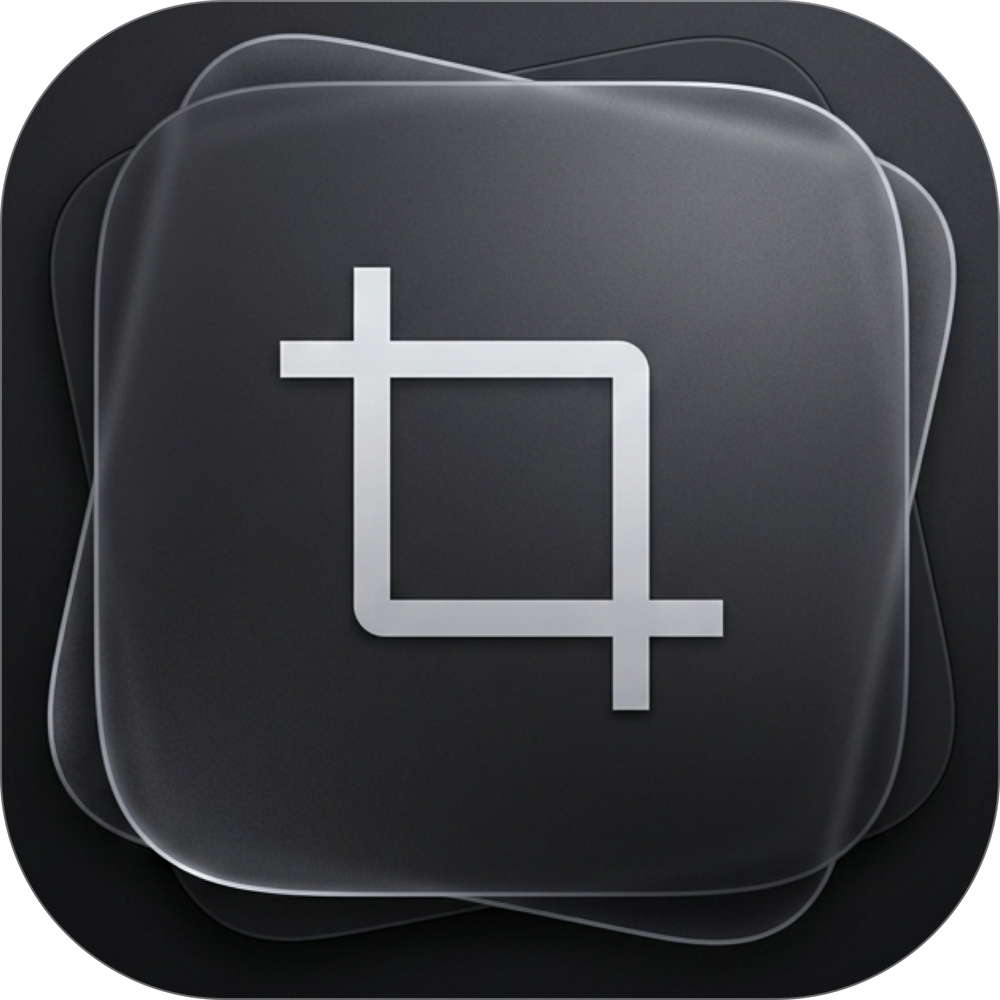
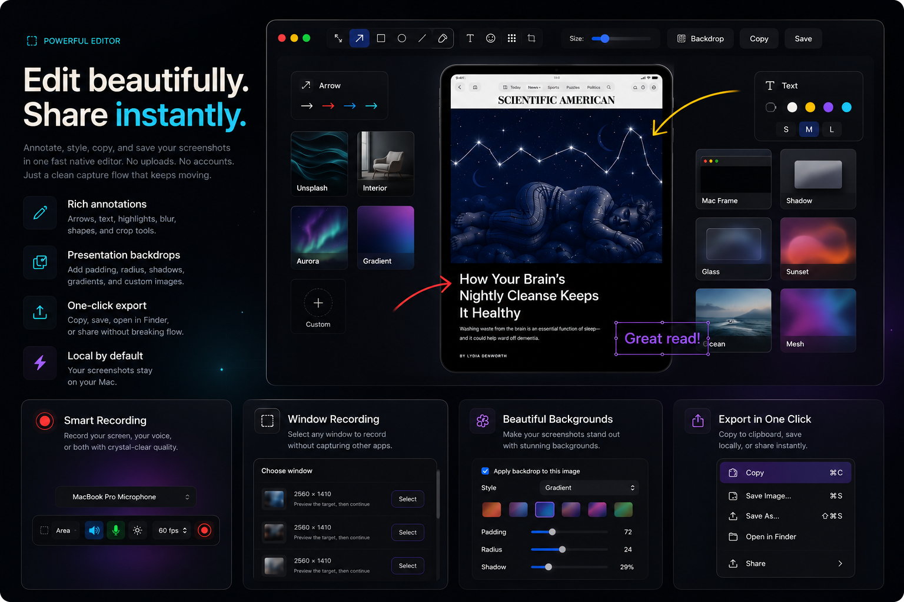

<p align="center">
  
  <h1 align="center">Shotnix</h1>
  <p align="center">
    A fast, focused screenshot and screen recording utility for macOS.<br/>
    Capture, record, annotate, pin, and extract text — all from your menu bar.
  </p>
  <p align="center">
    <a href="https://shotnix.com/"></a>
    <a href="https://github.com/OMARVII/Shotnix/releases/latest"></a>
    
    <a href="LICENSE"></a>
    
  </p>
</p>

---

> [!NOTE]
> **Shotnix is in beta (v0.24.0-beta).** Official downloads are signed and notarized with Apple Developer ID. The source code is available here for review and local builds.

<p align="center">
  
</p>

## Why Shotnix?

macOS has built-in screenshot tools, but they stop at capture. Shotnix picks up where they leave off — annotate with arrows, blur sensitive info, pin screenshots to your desktop, extract text with OCR, and access everything from a lightweight menu bar app. No subscription. No account. Just a fast tool that stays out of your way.

Visit **[shotnix.com](https://shotnix.com/)** for the latest download and project overview.

## Features

**Capture anything**
- **Area** — drag to select any region
- **Window** — click any window to capture it in isolation, with optional drop shadow and transparent padding
- **Fullscreen** — grab the entire screen instantly
- **All displays** — every connected display at once, one image each
- **Previous area** — re-capture the last selected region with one shortcut
- **Adjustable selection** — hold Shift as you let go (or make it the default in Settings) to fine-tune the edges with the mouse or arrow keys, then press Return
- **Scrolling** — scroll a long page and Shotnix stitches it into one tall image; press Esc or the shortcut again to stop
- **Timed** — a cancellable 3/5/10-second countdown before the shot
- **Screen recording** — record an area, window, or display to MP4 at 60 fps with system audio, microphone audio, and your camera. Pause and resume, discard a take, or start after a 3/5/10-second countdown. Window recordings follow the window and include its menus and sheets. Recordings survive crashes and are recovered on the next launch, a microphone that drops out is replaced without shifting the audio, and 5K and larger displays record in HEVC. Stop from anywhere with `Ctrl + Cmd + Esc`
- **Video editor** — turn any recording into a polished demo: zooms that follow your cursor, the real macOS cursor redrawn smoothly, backgrounds, annotations (text, arrows, highlights, blur, spotlight), your camera as its own layer (with layouts), captions in four looks and edit-by-text made on your Mac (with on-device translation on macOS 15+), background music that ducks under your voice, logos and image overlays, intro and outro cards, transitions, several recordings in one video, cleaner sound, vertical videos, crop, and exports to MP4 or GIF that run in the background
- **OCR** — extract text from any part of the screen, keeping columns and tables in reading order; links in the result are clickable, and you choose the recognition languages
- **QR and barcode scanning** — decode QR, Code 128, EAN, UPC, Aztec, Data Matrix, PDF417 and more from a selected screen area

**Annotate and edit**
- Arrows, rectangles (square or rounded corners), ellipses, lines, freehand drawing
- Text and callout bubbles: any size from 10 to 96 pt, bold or regular, several lines; double-click to edit again
- Highlighter and freehand highlighter for emphasizing content
- Spotlight to dim everything except what matters
- Blur and pixelate with adjustable strength that always covers the whole box, on any display
- Numbered markers for step-by-step guides
- Presentation backdrops for polished screenshot exports, including image presets and custom images
- Crop that you can undo or change later, with annotations still editable
- Saves at the capture's full resolution, whichever display the editor is on, and asks before closing or quitting with unsaved edits

**Stay in flow**
- Quick access overlay after every capture — hover to reveal controls (copy, save, edit, pin, close)
- Drag-and-drop from overlay directly into Finder, Slack, or any app
- Swipe-to-dismiss overlay with trackpad gesture
- Copy confirmation badge — visual feedback before closing
- Keyboard shortcuts on overlay — `Cmd+C` copy, `Cmd+S` save, `Cmd+E` edit, `Esc` dismiss
- Right-click context menu on overlay
- Spring animations and micro-interactions for a premium feel
- Pin screenshots to float on your desktop (draggable, resizable)
- Full capture history with a grid browser: search by the text inside screenshots (just start typing), filter by capture type, select with the keyboard, drag captures out as files, and undo deletes with ⌘Z
- History keeps captures forever by default, or only the last 7, 30, or 90 days (or the last 100, 500, or 1,000 captures); it shows how much space it uses and can clean up on demand
- Edits from the annotation editor appear in History, and the original capture is kept beside them
- Global hotkeys that work from anywhere

**Configurable**
- Tabbed settings window (General, Shortcuts, Screenshots, Recording, About)
- Customizable global hotkeys with one-click default reset
- Sparkle-powered in-app update checks for official builds
- Export as PNG or JPEG, with a JPEG quality slider (WebP too, on Macs whose system can write it)
- Auto-save location picker; captures taken in the same second get their own numbered files
- After-capture auto-actions (auto-copy, auto-save)
- Configurable overlay position (left or right) and timeout
- Capture sound effects (toggleable)
- Hide desktop icons during capture (without restarting Finder)
- Launch at login
- What's New changelog in the About tab

## Install

### Download (recommended)

1. Grab the latest `.dmg` from [**shotnix.com**](https://shotnix.com/) or [**Releases**](https://github.com/OMARVII/Shotnix/releases/latest)
2. Open the DMG and drag **Shotnix** to your Applications folder
3. Grant **Screen Recording** permission when prompted

### Build from source

```bash
git clone https://github.com/OMARVII/Shotnix.git
cd Shotnix
bash build-app.sh
```

This compiles a release build, assembles the app bundle, signs the binary locally, and copies `Shotnix.app` to `/Applications`.

**Requirements:** macOS 13+, Swift 5.9+

## Hotkeys

| Shortcut | Action |
|---|---|
| `Cmd + Shift + 4` | Area capture |
| `Cmd + Shift + 5` | Window capture |
| `Cmd + Shift + 3` / `Cmd + Shift + 6` | Fullscreen capture |
| `Cmd + Shift + 7` | Previous area capture |

Scrolling capture, text capture (OCR), all displays, timed capture, and the recording actions have no shortcut by default, so Shotnix never takes over keys other apps use (`Cmd + Shift + S` is Save As almost everywhere). Assign any of them in **Settings → Shortcuts**. Installs from before 0.24 keep the `Cmd + Shift + S` and `Cmd + Shift + O` shortcuts they had.

**On the quick access overlay:**

| Shortcut | Action |
|---|---|
| `Cmd + C` | Copy screenshot to clipboard |
| `Cmd + S` | Save to file |
| `Cmd + E` | Open in annotation editor |
| `Esc` | Dismiss overlay |

**While recording:**

| Shortcut | Action |
|---|---|
| `Ctrl + Cmd + Esc` | Stop recording (from any app) |
| `Esc` | Stop recording while Shotnix is in front |

## Architecture

Shotnix is a Swift Package Manager project — no `.xcodeproj`, no storyboards. The executable is a tiny wrapper around a testable `ShotnixCore` library.

```
Sources/
├── Shotnix/       Executable entry point
└── ShotnixCore/
    ├── App/           Application lifecycle, menu bar, preferences
    ├── Capture/       Screenshot engine (ScreenCaptureKit + CGWindow fallback)
    ├── Annotation/    Editor with 15 tools and undo/redo
    ├── History/       Persistent capture history (~Library/Application Support/)
    ├── Hotkeys/       Customizable global shortcuts
    ├── OCR/           Text recognition via Vision framework
    ├── Overlay/       Quick access thumbnail, pinned windows, toasts
    ├── Video/         Video editor: timeline, zooms, cursor, camera, captions, sound, export
    └── Utilities/     Image export, permissions, desktop icon toggle
```

## Dependencies

| Package | Purpose |
|---|---|
| [KeyboardShortcuts](https://github.com/sindresorhus/KeyboardShortcuts) | Customizable global keyboard shortcuts |
| [Sparkle](https://sparkle-project.org/) | In-app update checks for signed releases |

The app still keeps dependencies intentionally narrow.

## Roadmap

- [x] Multi-display capture fixes
- [x] First-launch onboarding
- [x] WebP export
- [x] After-capture auto-actions
- [x] Premium overlay redesign (hover controls, spring animations, swipe-to-dismiss)
- [x] Clean annotation toolbar (contextual buttons, centered canvas, dark editor background)
- [x] Numbered step counter annotation tool
- [x] Premium branding (app icon, menu bar icon, welcome screen)
- [x] Modernized preferences UI and capture engine
- [x] Snappy overlay animations + haptic feedback + pixel-perfect buttons
- [x] Native macOS APIs (replaced legacy shell `Process()` calls)
- [x] Customizable hotkeys
- [x] Window capture with shadow and padding
- [x] Delay/timer capture (3s, 5s, 10s)
- [x] Auto-update mechanism
- [x] Developer signing + notarization workflow
- [x] Stacked post-capture thumbnails
- [x] Video editor: zooms, smooth cursor, backgrounds, camera, captions, edit by text, export to MP4/GIF
- [x] Adjustable selection, a real scrolling-capture stitcher, and layout-aware OCR
- [x] New annotation tools: spotlight, callout, freehand highlighter, rounded rectangles
- [x] History retention, cleanup, and type filters
- [x] Pause/resume, discard, and crash-safe recordings
- [x] Video editor: music, image overlays, title cards, transitions, multi-recording projects, caption looks and translation
- [ ] Localization

## Contributing

Contributions are welcome. Open an issue first to discuss what you'd like to change.

## License

[MIT](LICENSE). Third-party asset provenance is listed in [THIRD_PARTY_NOTICES.md](THIRD_PARTY_NOTICES.md).
