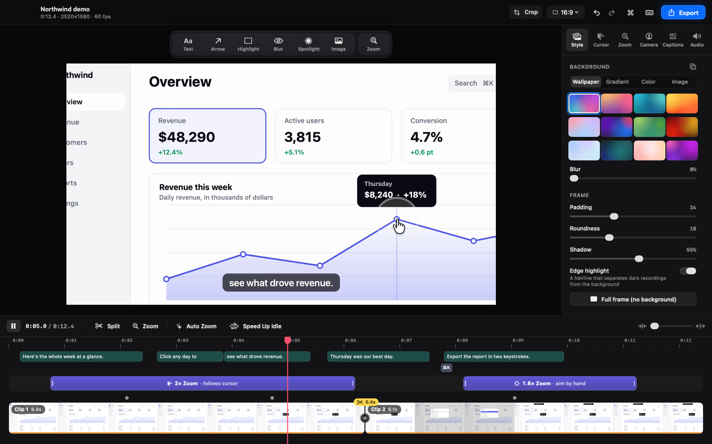

<div align="center">


# Shotnix

**Знімки й записи екрана та відеоредактор для вашого Mac.**<br/>
Безкоштовна програма з відкритим кодом. Нативна, близько 11 МБ, а все, що ви знімаєте й записуєте, лишається на вашому Mac.

[](https://github.com/OMARVII/Shotnix/releases/latest)
[](https://github.com/OMARVII/Shotnix/stargazers)
[](#встановлення)
[](LICENSE)

[Сайт](https://shotnix.com/uk) · [Завантажити](https://github.com/OMARVII/Shotnix/releases/latest) · [Що нового](CHANGELOG.md) · [Дорожня карта](ROADMAP.md) (англійською)

[English](README.md) · [Deutsch](README.de.md) · [Français](README.fr.md) · [简体中文](README.zh-CN.md) · [Русский](README.ru.md) · **Українська**

<a href="https://shotnix.com/media/shotnix-editor-playback.mp4"></a>

<sub>Відеоредактор Shotnix відтворює демо, зроблене з одного звичайного запису екрана: наближення в місцях клацань, плавний курсор, субтитри з озвучення й натиснуте скорочення на екрані.</sub>

<a href="https://shotnix.com/media/shotnix-editor-playback.mp4"><b>▶ Дивитися демо (Retina, 60 fps)</b></a><br/>
<sub>Shotnix експортує відео до 4K із частотою 60 fps.</sub>

</div>


## Чому Shotnix

<table>
<tr>
<td width="50%"><b>Одна програма для всього</b><br/>Знімки екрана, розпізнавання тексту, закріплені знімки, історія, запис екрана й повноцінний відеоредактор.</td>
<td width="50%"><b>Нативна й легка</b><br/>Написана на Swift для macOS. Невеликий розмір, миттєвий запуск, і програма не заважає працювати.</td>
</tr>
<tr>
<td width="50%"><b>Приватна за задумом</b><br/>Без облікового запису, хмари й аналітики. Субтитри та розпізнавання тексту працюють просто на вашому Mac.</td>
<td width="50%"><b>Справді безкоштовна</b><br/>Ліцензія MIT. Без водяних знаків і передплати. Підписана, нотаризована й оновлюється сама.</td>
</tr>
</table>

## Знімки екрана


- **Знімайте що завгодно:** область, вікно, весь екран, усі дисплеї одночасно або довгу сторінку з прокручуванням, зшиту в одне зображення.
- **Кадруйте точно:** утримуйте ⇧, коли відпускаєте кнопку миші, щоб доналаштувати вибір перед знімком.
- **Розмічайте:** стрілки, фігури, текст, виноски, нумеровані кроки, прожектор, маркери, а також розмиття й пікселізація, що надійно все приховують.
- **Працюйте далі:** копіюйте текст звідусіль (разом із таблицями й посиланнями), закріплюйте знімки на екрані та знаходьте будь-який знімок за текстом на ньому.

## Запис екрана й відеомонтаж

- **Записуйте** область, вікно чи дисплей із частотою 60 fps — разом із вашим голосом, системним звуком і камерою. Призупиняйте, продовжуйте й не втрачайте жодного дубля навіть після збою.
- **Запис відкривається вже змонтованим:** наближення там, де ви клацаєте, плавно перемальований справжній курсор macOS і ваш збережений стиль.
- **Доводьте до ладу на своєму Mac:** субтитри й монтаж за текстом із вашого мовлення (з перекладом у macOS 15+), музика, що стишується під голос, заставки, переходи й ваш логотип.
- **Експортуйте** в MP4 (до 4K і 60 fps) або GIF — у фоні чи одразу в буфер обміну.


<details>
<summary><b>Усі функції</b></summary>

**Знімання**

- **Область** — перетягніть, щоб вибрати будь-яку ділянку
- **Вікно** — клацніть будь-яке вікно, щоб зняти лише його, за бажання з тінню та прозорим відступом
- **Весь екран** — миттєвий знімок усього екрана
- **Усі дисплеї** — усі під’єднані дисплеї одночасно, по окремому зображенню на кожен
- **Попередня область** — повторно зніміть останню вибрану ділянку одним скороченням
- **Налаштовуваний вибір** — утримуйте Shift, коли відпускаєте кнопку миші (або зробіть це типовою поведінкою в «Параметрах»), щоб точно підлаштувати краї мишею чи клавішами зі стрілками, а потім натисніть Return
- **Знімок із прокручуванням** — прокручуйте довгу сторінку, і Shotnix зшиє її в одне високе зображення; щоб зупинити, натисніть Esc або те саме скорочення ще раз
- **Знімок за таймером** — зворотний відлік на 3, 5 чи 10 секунд перед знімком (його можна скасувати)
- **Запис екрана** — записуйте область, вікно чи дисплей у MP4 із частотою 60 fps разом із системним звуком, мікрофоном і камерою. Призупиняйте й продовжуйте, відкидайте невдалі дублі або починайте після зворотного відліку на 3, 5 чи 10 секунд. Під час запису вікна Shotnix стежить за ним і захоплює також його меню та діалоги. Записи переживають збої й відновлюються під час наступного запуску; якщо мікрофон відключиться, його замінить інший без зсуву звуку, а дисплеї від 5K записуються в HEVC. Зупинити запис з будь-якої програми можна клавішами `Ctrl + Cmd + Esc`
- **Відеоредактор** — перетворіть будь-який запис на відшліфоване демо: наближення, що стежать за курсором, плавно перемальований справжній курсор macOS, тло, розмітка (текст, стрілки, виділення, розмиття, прожектор), камера окремим шаром (з макетами), субтитри в чотирьох стилях і монтаж за текстом, створені на вашому Mac (з перекладом просто на пристрої в macOS 15+), фонова музика, що стишується під ваш голос, логотипи й накладені зображення, вступні та завершальні заставки, переходи, кілька записів в одному відео, чистіший звук, вертикальні відео, обрізання та експорт у MP4 чи GIF, що працює у фоні
- **OCR** — розпізнавайте текст із будь-якої частини екрана, зберігаючи порядок читання в колонках і таблицях; на посилання в результаті можна клацнути, а мови розпізнавання ви обираєте самі
- **Сканування QR-кодів і штрихкодів** — зчитуйте QR, Code 128, EAN, UPC, Aztec, Data Matrix, PDF417 та інші коди з вибраної області екрана

**Розмітка й редагування**

- Стрілки, прямокутники (з прямими чи заокругленими кутами), еліпси, лінії, малювання від руки
- Текст і виноски: будь-який розмір від 10 до 96 пт, жирний чи звичайний, у кілька рядків; двічі клацніть, щоб відредагувати знову
- Маркер і маркер від руки, щоб виділити головне
- Прожектор, що затемнює все, крім важливого
- Розмиття й пікселізація з регульованою силою, що завжди приховують усю область, на будь-якому дисплеї
- Нумеровані позначки для покрокових інструкцій
- Презентаційне тло для ефектних знімків — із готових шаблонів або з власних зображень
- Обрізання, яке можна відмінити чи змінити пізніше; розмітка й далі лишається редагованою
- Зберігає в повній роздільності знімка, незалежно від того, на якому дисплеї відкрито редактор, і перепитує, перш ніж закрити вікно чи завершити програму з незбереженими змінами

**Без зупинок**

- Мініатюра швидкого доступу після кожного знімка — наведіть курсор, щоб побачити кнопки (скопіювати, зберегти, редагувати, закріпити, закрити)
- Перетягуйте мініатюру просто у Finder, Slack чи будь-яку іншу програму
- Змахніть мініатюру жестом на трекпеді, щоб закрити її
- Позначка «Скопійовано» — видиме підтвердження перед закриттям
- Клавіатурні скорочення на мініатюрі — `Cmd+C` копіює, `Cmd+S` зберігає, `Cmd+E` відкриває редактор, `Esc` закриває мініатюру
- Контекстне меню мініатюри за клацанням правою кнопкою
- Пружні анімації й мікровзаємодії для відчуття довершеності
- Закріплюйте знімки поверх робочого столу (можна перетягувати й змінювати розмір)
- Повна історія знімків у вигляді сітки: шукайте за текстом на знімках (просто почніть вводити), фільтруйте за типом знімка, вибирайте клавіатурою, перетягуйте знімки назовні як файли й відміняйте видалення клавішами ⌘Z
- Історія типово зберігає знімки назавжди або лише за останні 7, 30 чи 90 днів (чи останні 100, 500 або 1000 знімків); вона показує, скільки місця займає, і прибирає зайве на вимогу
- Зміни з редактора знімків з’являються в історії, а оригінальний знімок зберігається поруч
- Глобальні клавіатурні скорочення, що працюють будь-де

**Гнучке налаштування**

- Вікно параметрів із вкладками («Загальні», «Скорочення», «Знімки екрана», «Запис», «Про програму»)
- Глобальні скорочення на ваш смак; кнопка «Відновити типові» повертає їх одним клацанням
- Вбудована перевірка оновлень через Sparkle (для офіційних збірок)
- Експорт у PNG або JPEG із повзунком якості JPEG (а також у WebP на тих Mac, чия система вміє його записувати)
- Вибір папки для автозбереження; знімки, зроблені в ту саму секунду, отримують окремі пронумеровані файли
- Автоматичні дії після знімання (автокопіювання, автозбереження)
- Розташування мініатюри (ліворуч або праворуч) і тривалість її показу
- Звук знімання (можна вимкнути)
- Приховування значків робочого столу під час знімання (без перезапуску Finder)
- Параметр «Відкривати Shotnix під час входу»
- Список змін «Що нового» у вкладці «Про програму»

</details>

## Мови

Shotnix розмовляє **English, Deutsch, Français, 简体中文, Русский та Українська** — від смуги меню до відеоредактора. Типово програма використовує мову вашого Mac; щоб вибрати іншу, відкрийте в самому Shotnix «Параметри» → «Загальні» → «Мова». Переклади зберігаються в папці [`Localization/`](Localization/). Якщо одна з цих мов для вас рідна, ваші виправлення дуже вітаються.

## Встановлення

### Завантаження (рекомендовано)

1. Завантажте останній `.dmg` із [**shotnix.com**](https://shotnix.com/uk) або зі сторінки [**Releases**](https://github.com/OMARVII/Shotnix/releases/latest) на GitHub
2. Відкрийте DMG і перетягніть **Shotnix** у папку «Програми»
3. Коли з’явиться запит, надайте дозвіл на **запис екрана**

### Збирання з вихідного коду

```bash
git clone https://github.com/OMARVII/Shotnix.git
cd Shotnix
bash build-app.sh
```

Скрипт компілює релізну збірку, складає пакет програми, локально підписує бінарний файл і копіює `Shotnix.app` у `/Applications`.

**Вимоги:** macOS 13+, Swift 5.9+

## Клавіатурні скорочення

| Скорочення | Дія |
|---|---|
| `Cmd + Shift + 4` | Зняти область |
| `Cmd + Shift + 5` | Зняти вікно |
| `Cmd + Shift + 3` / `Cmd + Shift + 6` | Зняти весь екран |
| `Cmd + Shift + 7` | Зняти попередню область |

Типово без скорочень лишаються «Знімок із прокручуванням», «Розпізнати текст» (OCR), «Зняти всі дисплеї», «Знімок за таймером» і команди запису — тож Shotnix не перехоплює клавіші, якими користуються інші програми (`Cmd + Shift + S` майже всюди означає «Зберегти як…»). Призначити будь-яке з них можна в **«Параметри» → «Скорочення»**. Якщо Shotnix було встановлено до версії 0.24, його попередні скорочення `Cmd + Shift + S` і `Cmd + Shift + O` зберігаються.

**На мініатюрі швидкого доступу:**

| Скорочення | Дія |
|---|---|
| `Cmd + C` | Скопіювати знімок у буфер обміну |
| `Cmd + S` | Зберегти у файл |
| `Cmd + E` | Відкрити в редакторі знімків |
| `Esc` | Закрити мініатюру |

**Під час запису:**

| Скорочення | Дія |
|---|---|
| `Ctrl + Cmd + Esc` | Зупинити запис (з будь-якої програми) |
| `Esc` | Зупинити запис, коли Shotnix на передньому плані |

## Приватність

У Shotnix немає облікового запису, аналітики й хмари. Усе відбувається на вашому Mac. macOS запитує дозвіл, перш ніж Shotnix зможе використовувати:

- **Запис екрана:** щоб робити знімки й записи.
- **Мікрофон і камера:** лише коли ви вмикаєте їх для запису.
- **Розпізнавання мовлення:** щоб створювати субтитри просто на цьому Mac.
- **Доступність** (необов’язково): щоб показувати в записі клавіатурні скорочення, які ви натискаєте.

В інтернет програма звертається лише для перевірки оновлень.

## Архітектура

Shotnix — це проєкт Swift Package Manager, без `.xcodeproj` і сторібордів. Виконуваний файл — лише тонка обгортка навколо бібліотеки `ShotnixCore`, яку можна тестувати.

```
Sources/
├── Shotnix/       Точка входу виконуваного файлу
└── ShotnixCore/
    ├── App/           Життєвий цикл програми, смуга меню, параметри
    ├── Capture/       Рушій знімків (ScreenCaptureKit + резервний CGWindow)
    ├── Annotation/    Редактор із 15 інструментами, відміною та повтором
    ├── History/       Постійна історія знімків (~Library/Application Support/)
    ├── Hotkeys/       Налаштовувані глобальні скорочення
    ├── OCR/           Розпізнавання тексту через фреймворк Vision
    ├── Overlay/       Мініатюра швидкого доступу, закріплені вікна, спливні сповіщення
    ├── Video/         Відеоредактор: шкала часу, наближення, курсор, камера, субтитри, звук, експорт
    └── Utilities/     Експорт зображень, дозволи, приховування значків робочого столу
Localization/          String Catalog, переклади й глосарій (scripts/localize.py)
```

## Залежності

| Пакет | Призначення |
|---|---|
| [KeyboardShortcuts](https://github.com/sindresorhus/KeyboardShortcuts) | Налаштовувані глобальні клавіатурні скорочення |
| [Sparkle](https://sparkle-project.org/) | Перевірка оновлень у програмі для підписаних релізів |

Залежностей у програмі, як і раніше, свідомо мінімум.

## Дорожня карта

- [x] Виправлення знімання на кількох дисплеях
- [x] Знайомство з програмою під час першого запуску
- [x] Експорт у WebP
- [x] Автоматичні дії після знімання
- [x] Новий преміальний дизайн мініатюри (кнопки під час наведення курсора, пружні анімації, закриття змахом)
- [x] Охайна панель інструментів розмітки (контекстні кнопки, полотно по центру, темне тло редактора)
- [x] Інструмент нумерованих кроків
- [x] Преміальний брендинг (значок програми, значок у смузі меню, екран привітання)
- [x] Оновлений інтерфейс параметрів і рушій знімання
- [x] Жваві анімації мініатюри + тактильний відгук + піксельно точні кнопки
- [x] Нативні API macOS (замість застарілих викликів оболонки через `Process()`)
- [x] Налаштовувані клавіатурні скорочення
- [x] Знімок вікна з тінню та відступом
- [x] Знімок за таймером (3 с, 5 с, 10 с)
- [x] Автоматичне оновлення
- [x] Підписування сертифікатом розробника + нотаризація
- [x] Мініатюри після знімання, складені стосом
- [x] Відеоредактор: наближення, плавний курсор, тло, камера, субтитри, монтаж за текстом, експорт у MP4/GIF
- [x] Налаштовуваний вибір, справжнє зшивання знімків із прокручуванням і OCR, що розуміє макет сторінки
- [x] Нові інструменти розмітки: прожектор, виноска, маркер від руки, заокруглені прямокутники
- [x] Історія: термін зберігання, прибирання й фільтри за типом
- [x] Пауза й продовження, відкидання дублів і записи, стійкі до збоїв
- [x] Відеоредактор: музика, накладені зображення, заставки, переходи, проєкти з кількох записів, стилі й переклад субтитрів
- [x] Локалізація: німецька, французька, спрощена китайська, російська та українська

## Як долучитися

Внески вітаються. Спершу створіть задачу (issue), щоб обговорити, що саме ви хочете змінити. Особливо чекаємо на виправлення перекладів: дивіться [`Localization/GLOSSARY.md`](Localization/GLOSSARY.md).

Якщо Shotnix заощаджує вам час, поставте ⭐ на GitHub — так програму легше знайдуть інші.

## Ліцензія

[MIT](LICENSE). Походження сторонніх ресурсів описано в [THIRD_PARTY_NOTICES.md](THIRD_PARTY_NOTICES.md).
